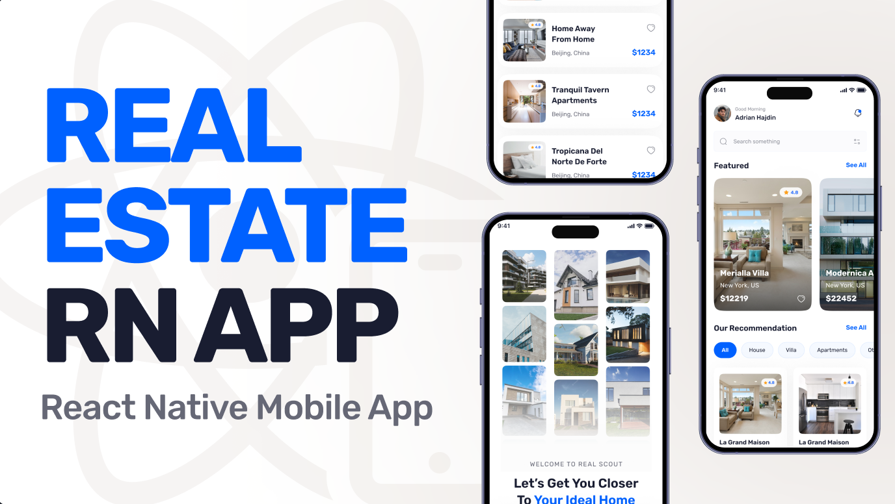

<div align="center">
  <br />
    <a href="https://youtu.be/YOUR_DEMO_LINK" target="_blank">
      
    </a>
  <br />
  <div>
    
    
    
    
  </div>

  <h3 align="center">🏡 Real Scout – Real Estate App</h3>

   <div align="center">
     A modern cross-platform real estate application built with React Native, designed for browsing, searching, and managing property listings with ease.
    </div>
</div>

## 📋 <a name="table">Table of Contents</a>
1. 🤖 [Introduction](#introduction)  
2. ⚙️ [Tech Stack](#tech-stack)  
3. 🔋 [Features](#features)  
4. 🤸 [Quick Start](#quick-start)  
5. 📞 [Contacts](#contacts)
6. 🚀 [Show Your Support](#show-your-support)

---

## <a name="introduction">🤖 Introduction</a>

**Real Scout** is a full-stack real estate mobile app built using **React Native**, **Expo SDK 52**, **Appwrite**, **Tailwind CSS**, and **TypeScript**.  
It allows users to search, filter, and view property details, save favorites, and manage their profiles — all in one seamless and visually appealing interface.

---

## <a name="tech-stack">⚙️ Tech Stack</a>

- **[Expo](https://expo.dev/)** – For building cross-platform mobile apps with React Native.
- **[React Native](https://reactnative.dev/)** – Framework for building native UIs with React.
- **[Appwrite](https://appwrite.io/)** – Backend-as-a-Service for authentication, database, and file storage.
- **[TypeScript](https://www.typescriptlang.org/)** – Type-safe JavaScript for better scalability and maintainability.
- **[NativeWind](https://www.nativewind.dev/)** + **[Tailwind CSS](https://tailwindcss.com/)** – Utility-first styling for rapid UI development.

## 🎨 UI/UX Design

The entire interface of **Real Scout – Real Estate App** was designed with a focus on delivering a seamless and engaging property-browsing experience.  
From the onboarding screens to property detail views, every element follows a clean, modern, and user-friendly design system that enhances both functionality and aesthetics.

<p align="center">
  <a href="https://www.figma.com/design/YOUR_FIGMA_PROJECT_LINK" target="_blank">
    
  </a>
</p>

> ✨ Crafted with attention to detail to ensure a smooth user journey across Android and iOS platforms.


---

## <a name="features">🔋 Features</a>

- 🔐 **Google Authentication** – Secure login for users.  
- 🏠 **Home Page** – Shows latest and recommended properties with search and filter.  
- 🌎 **Explore Page** – Browse all property types with an intuitive UI.  
- 🏡 **Property Details Page** – View photos, pricing, and full property information.  
- 👤 **Profile Page** – Manage profile details and preferences.  
- ⚡ **Centralized Data Fetching** – Inspired by TanStack’s `useQuery` for efficient API calls.  

---

## <a name="quick-start">🤸 Quick Start</a>

**Prerequisites**  
- [Git](https://git-scm.com/)  
- [Node.js](https://nodejs.org/en)  
- [npm](https://www.npmjs.com/)  

**Cloning the Repository**
```bash
git clone https://github.com/Itssanthoshhere/Real-Scout.git
cd Real-Scout
````

**Installation**

```bash
npm install
```

**Environment Variables**
Create `.env.local` and add:

```env
EXPO_PUBLIC_APPWRITE_ENDPOINT=https://cloud.appwrite.io/v1
EXPO_PUBLIC_APPWRITE_PROJECT_ID=
EXPO_PUBLIC_APPWRITE_DATABASE_ID=
EXPO_PUBLIC_APPWRITE_GALLERIES_COLLECTION_ID=
EXPO_PUBLIC_APPWRITE_REVIEWS_COLLECTION_ID=
EXPO_PUBLIC_APPWRITE_AGENTS_COLLECTION_ID=
EXPO_PUBLIC_APPWRITE_PROPERTIES_COLLECTION_ID=
```

*(Fill in your Appwrite credentials)*

**Run the App**

```bash
npx expo start
```

---

## 🙌 Special Thanks

Inspired by **JavaScript Mastery’s** tutorials, but built with my own improvements, custom UI, and bug fixes.

---

## <a name="contacts">🔗 Contacts</a>

Feel free to connect with me:

* GitHub: [Itssanthoshhere](https://github.com/Itssanthoshhere)
* LinkedIn: [Santhosh VS](https://www.linkedin.com/in/thesanthoshvs/)

---

## ⭐️ Show Your Support

If you liked this project, drop a ⭐ on the repo and share it with others!

